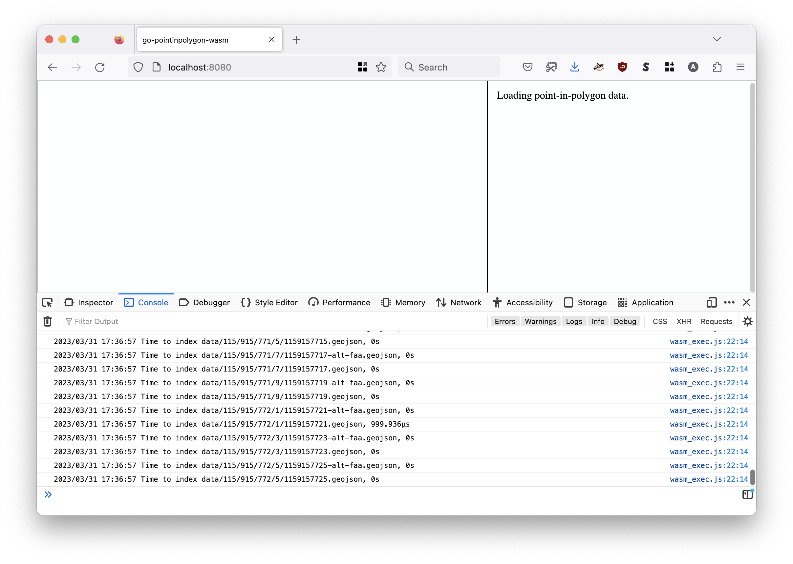
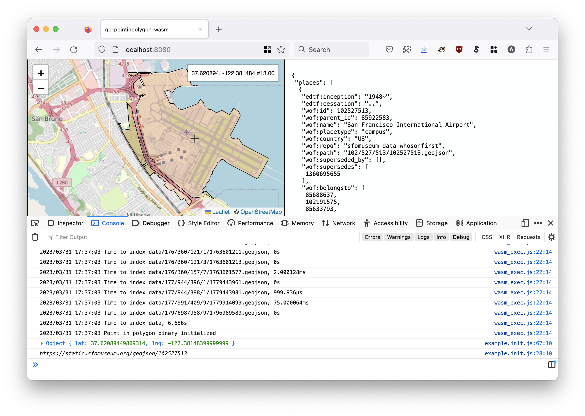
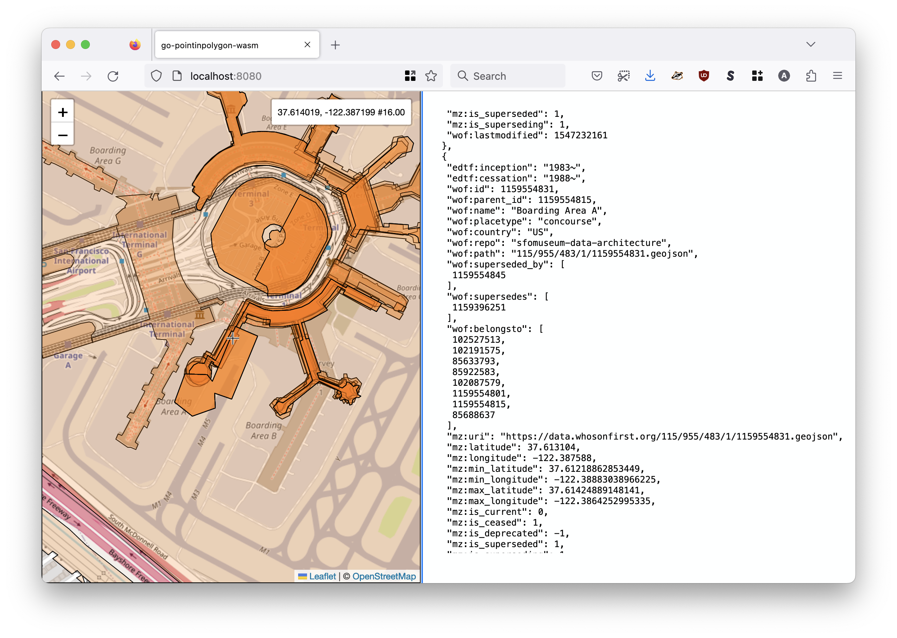

# go-pointinpolygon-wasm

Experimental work to embed a `whosonfirst/go-whosonfirst-spatial/database.SpatialDatabase` instance and all its data in a WebAssembly (WASM) binary to perform point-in-polygon operations.

## Motivation

The first thing to understand is that this work is _experimental_. The second thing to understand is that, as written, it is both slower and significantly larger than alternative approaches. Like, absurdly so.

Specifically, the WASM binary produced by this code is 19MB. There are a few reasons for this. First, the code used to build the WASM binary has not been optimized for size. Second, the binary bundles also all the data contained in the [sfomuseum-data/sfomuseum-data-architecture](https://github.com/sfomuseum-data/sfomuseum-data-architecture) repository rather than a canned index (or at least input data that has been pruned of unnecessary properties).

The trick here is being able to bundle data using Go's [embed](https://pkg.go.dev/embed) package to create an in-memory filesystem because WASM binaries don't have any concept of a filesystem. The ideal scenario would to bundle a point-in-polygon-enabled Protomaps database with the binary which works until it doesn't. Specifically an important depedency of the [Protomaps Go library](https://github.com/sfomuseum/go-pmtiles/tree/fs-bucket) doesn't support WebAssembly and [doesn't look it will any time soon](https://gitlab.com/cznic/sqlite/-/issues/91).

_If you're not sure what the words "point-in-polygon-enabled Protomaps database" mean, have a look at the [A global point-in-polygon service using a static 8GB data file](https://millsfield.sfomuseum.org/blog/tags/pointinpolygon) blog post._

The next best option would be to use one of the Go SQLite databases but they are depend on loading databases from an actual filesystem and don't support Go's in-memory embedded filesystems. And WASM has no concept of a filesystem so the whole thing starts to feel a bit absurd.

So, instead this code builds [an in-memory RTree spatial index](https://github.com/whosonfirst/go-whosonfirst-spatial-rtree) which is populated from data stored in the in-memory embedded filesystem. And it works. And doesn't even take _too_ long.

But it is absolutely not the most efficient way to do things. At least not yet. Regardless it is interesting to think about bundling both data and discrete functionality (for example, point-in-polygon operations) in a single WebAssembly binary which could be useful going forward.

## Example

You will need to have the [Go programming language](https://go.dev/dl) installed to run this example. Once you do type the following in a terminal window:

```
$> make example
go run -mod vendor cmd/example/main.go
2023/03/31 17:36:47 Listening for requests on localhost:8080
```

The when you open `http://localhost:8080` in a browser you'll see something like this:



It will take about 5-10 seconds for all the data to be indexed.



Once the data is loaded the webpage will load a map and perform an initial point-in-polygon query for the point at the map's center point. This will return the record for San Francisco International Airport campus. The can see the JSON-encoded results for the query displayed on the right.



As you pan the map, new point-in-polygon queries will be performed and all the results for current and historical records will be displayed on the map.

That's all this example application does for now.

## See also

* https://github.com/sfomuseum-data/sfomuseum-data-architecture
* https://github.com/whosonfirst/go-whosonfirst-spatial
* https://github.com/whosonfirst/go-whosonfirst-spatial-rtree
* https://github.com/whosonfirst/go-whosonfirst-spatial-pmtiles
* https://millsfield.sfomuseum.org/blog/tags/pointinpolygon
* https://millsfield.sfomuseum.org/blog/tags/reversegeocoding